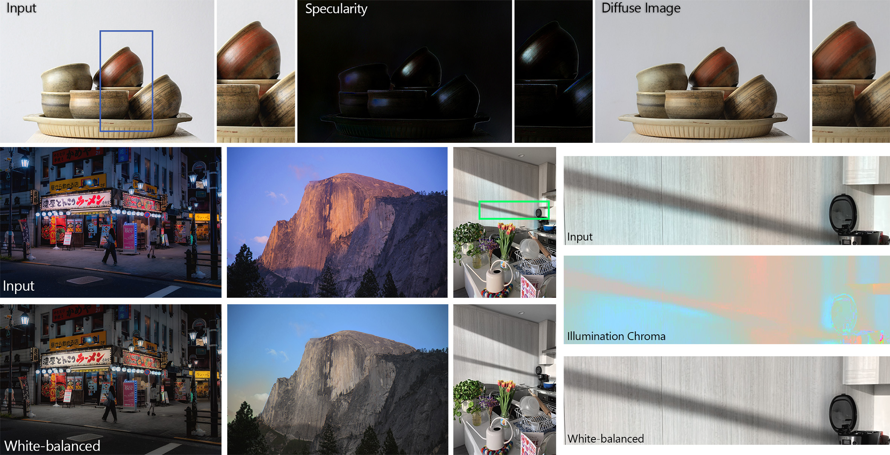

# Intrinsic Image Decomposition

This repository contains the code for the following papers: 

**Colorful Diffuse Intrinsic Image Decomposition in the Wild**, [Chris Careaga](https://ccareaga.github.io/) and [Yağız Aksoy](https://yaksoy.github.io), ACM Transactions on Graphics, 2024 \
[Project](https://yaksoy.github.io/ColorfulShading/) | [Paper](https://yaksoy.github.io/papers/TOG24-ColorfulShading.pdf) | [Supplementary](https://yaksoy.github.io/papers/TOG24-ColorfulShading-supp.pdf) | [Demo](https://huggingface.co/spaces/ccareaga/Intrinsic)

**Intrinsic Image Decomposition via Ordinal Shading**, [Chris Careaga](https://ccareaga.github.io/) and [Yağız Aksoy](https://yaksoy.github.io), ACM Transactions on Graphics, 2023 \
[Project](https://yaksoy.github.io/intrinsic/) | [Paper](https://yaksoy.github.io/papers/TOG23-Intrinsic.pdf) | [Video](https://www.youtube.com/watch?v=pWtJd3hqL3c) | [Supplementary](https://yaksoy.github.io/papers/TOG23-Intrinsic-Supp.pdf) | [Data](https://github.com/compphoto/MIDIntrinsics)

_Patent pending_
 
---


We propose a method for generating high-resolution intrinsic image decompositions for in-the-wild images. Our method consists of multiple stages. We first estimate a grayscale shading layer using our ordinal shading pipeline. We then estimate low-resolution chromaticity information to account for colorful illumination effects while maintaining global consistency. Using this initial colorful decomposition, we estimate a high-resolution, sparse albedo layer. We show that our decomposition allows us to train a diffuse shading estimation network using only a single rendered indoor dataset. 


Our estimated components unlock multiple illumination-aware editing operations such as per-pixel white balancing and specularity removal:



Try out our pipeline on your own images in Colab [](https://colab.research.google.com/github/compphoto/Intrinsic/blob/main/intrinsic_inference.ipynb) or on <a href="https://huggingface.co/spaces/ccareaga/Intrinsic">

</a>

## Setup
Depending on how you would like to use the code in this repository there are two options to setup the code.
In either case, you should first create a fresh virtual environment (`python3 -m venv intrinsic_env`) and start it (`source intrinsic_env/bin/activate`)

You can install this repository as a package using `pip`:
```
git clone https://github.com/compphoto/Intrinsic
cd Intrinsic
pip install .
```
If you want to make changes to the code and have it reflected when you import the package use `pip install --editable`
Or perform the same action without cloning the code using:
```
pip install https://github.com/compphoto/Intrinsic/archive/main.zip
```
This will allow you to import the repository as a Python package, and use our pipeline as part of your codebase.

## Inference
To run our pipeline on your own images you can use the decompose script:
```python

from chrislib.data_util import load_image

from intrinsic.pipeline import load_models, run_pipeline

# load the models from the given paths
models = load_models('v2')

# load an image (np float array in [0-1])
image = load_image('/path/to/input/image')

# run the model on the image using R_0 resizing
results = run_pipeline(models, image)

albedo = results['hr_alb']
diffuse_shading = results['dif_shd']
residual = results['residual']
# + multiple other keys for different intermediate components

```
This will run our pipeline and output the linear intrinsic components. 

You can run this in your browser too! [](https://colab.research.google.com/github/compphoto/Intrinsic/blob/main/intrinsic_inference.ipynb) or <a href="https://huggingface.co/spaces/ccareaga/Intrinsic">

</a>


Here are the components stored in the resulting dictionary returned by our pipeline:

| Key          | Description |
| --------     | -------     |
| 'image'      | input image after specified resizing scheme   |
| 'lin_img'    | input image after undoing gamma correction |
| 'ord_full'   | full-resolution ordinal shading estimation |
| 'ord_full'   | base-resolution ordinal shading estimation  |
| 'gry_shd'    | grayscale shading from ordinal pipeline     |
| 'gry_alb'    | implied albedo from the ordinal pipeline (img / gry_shd)   |
| 'lr_clr'     | estimated low-resolution shading chromaticity |
| 'lr_alb'     | implied albedo after shading chromaticity estimation (img / lr_shd) |
| 'lr_shd'     | high-resolution grayscale shading + low-res chroma   |
| 'hr_alb'     | final high-resolution albedo estimation    |
| 'hr_shd'     | implied shading of the final albedo (img / hr_alb) |
| 'hr_clr'     | visualized chroma of hr_shd   |
| 'wb_img'     | white-balanced image - hr_alb * luminance(hr_shd)    |
| 'dif_shd'    | diffuse shading estimation   |
| 'dif_img'    | diffuse image (hr_alb * dif_shd)    |
| 'residual'   | residual component (img - dif_img)    |
| 'neg_res'    | negative part of the residual component (due to saturated input pixels)    |
| 'pos_res'    | positive part of the residual component (specularities, light sources, etc)  |

## Citation

```
@ARTICLE{careagaColorful,
 author={Chris Careaga and Ya\u{g}{\i}z Aksoy},
 title={Colorful Diffuse Intrinsic Image Decomposition in the Wild},
 journal={ACM Trans. Graph.},
 year={2024},
 volume = {43},
 number = {6},
 articleno = {178},
 numpages = {12},
}

@ARTICLE{careagaIntrinsic,
 author={Chris Careaga and Ya\u{g}{\i}z Aksoy},
 title={Intrinsic Image Decomposition via Ordinal Shading},
 journal={ACM Trans. Graph.},
 year={2023},
 volume = {43},
 number = {1},
 articleno = {12},
 numpages = {24},
}
```

## License

This implementation is provided for academic use only. Please cite our paper if you use this code or any of the models. 

The methodology presented in this work is safeguarded under intellectual property protection. For inquiries regarding licensing opportunities, kindly reach out to SFU Technology Licensing Office &#60;tlo_dir <i>ατ</i> sfu <i>δøτ</i> ca&#62; and Dr. Yağız Aksoy &#60;yagiz <i>ατ</i> sfu <i>δøτ</i> ca&#62;.
