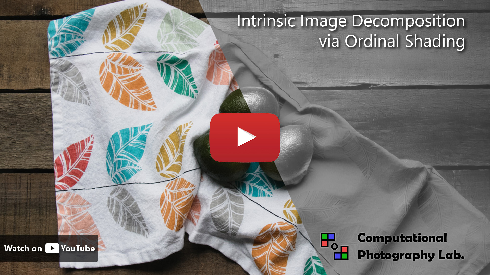
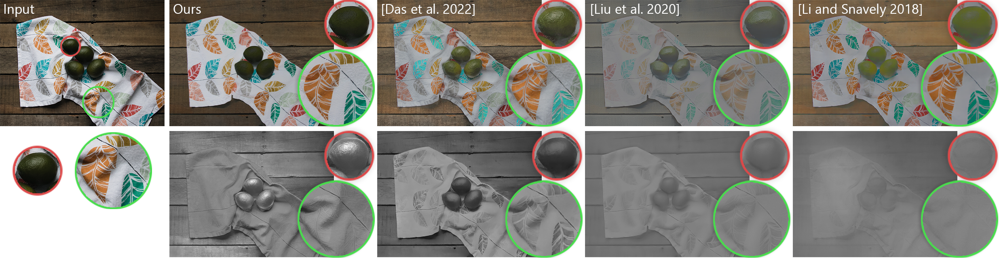
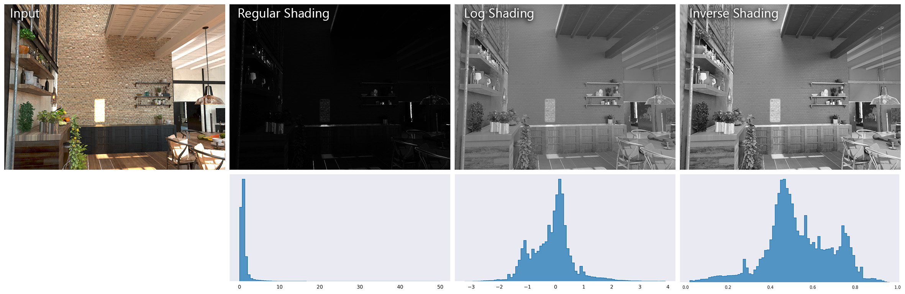
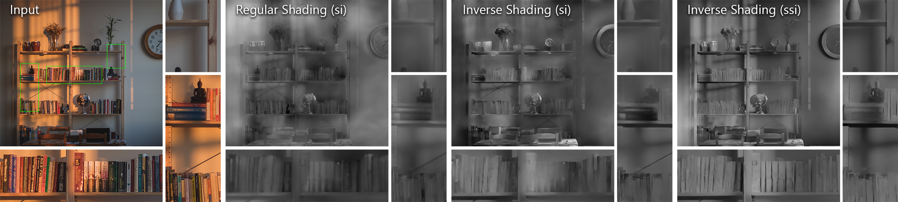
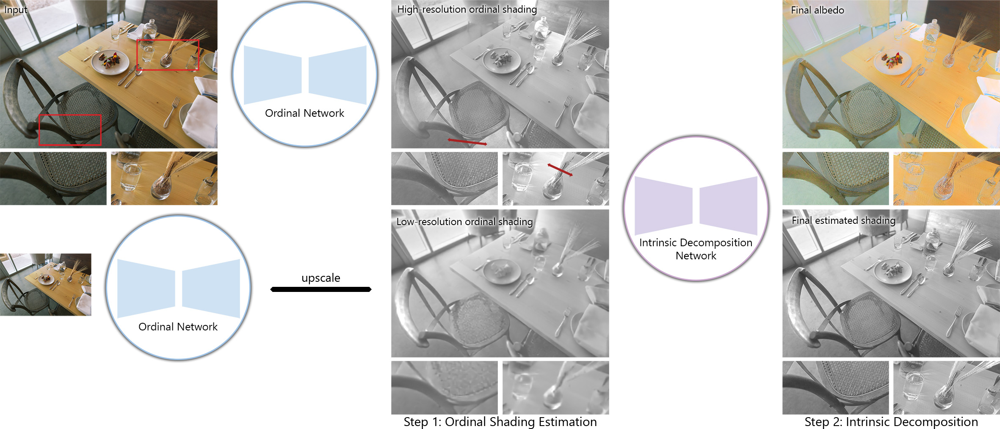
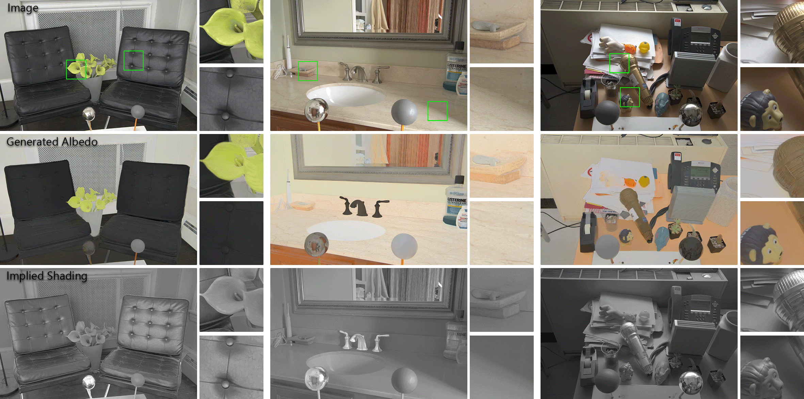
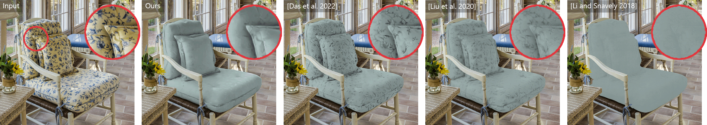

# Intrinsic Image Decomposition via Ordinal Shading
Code for the paper: Intrinsic Image Decomposition via Ordinal Shading, [Chris Careaga](https://ccareaga.github.io/) and [Yağız Aksoy](https://yaksoy.github.io), ACM Transactions on Graphics, 2023 
### [Project Page](https://yaksoy.github.io/intrinsic) | [Paper](https://yaksoy.github.io/papers/TOG23-Intrinsic.pdf) | [Video](https://www.youtube.com/watch?v=pWtJd3hqL3c) | [Supplementary](https://yaksoy.github.io/papers/TOG23-Intrinsic-Supp.pdf) | [Data](https://github.com/compphoto/MIDIntrinsics)

We propose a method for generating high-resolution intrinsic image decompositions, for in-the-wild images. Our method relies on a carefully formulated ordinal shading representation, and real-world supervision from multi-illumination data in order to predict highly accurate albedo and shading. 

[](https://www.youtube.com/watch?v=pWtJd3hqL3c)


Try out our pipeline on your own images! [](https://colab.research.google.com/github/compphoto/Intrinsic/blob/main/intrinsic_inference.ipynb)

## Method
The inherently under-constrained and scale-invariant nature of the intrinsic decomposition makes it a challenging problem. 
Shading, which represents complex interactions in the scene, is difficult for neural networks to predict. 
Compounded by the scarcity of dense ground-truth data, state-of-the-art models fail at high resolutions in real-world scenarios.



Our method focuses on generating high-resolution shading estimations, rather than attempting to estimate shading and albedo separately. 
Since shading values are unbounded, we develop a representation of shading values called "inverse shading" which maps the shading values into the zero-one range.
This creates a balanced distribution of values in a well-defined range that is desirable for training neural networks.



Rather than directly regressing the inverse shading values, we relax the problem and aim to predict *ordinal* shading values.
To do this, we train our network using shift- and scale-invariant loss functions. 
This simplifies the task of shading estimation as the model does not need to estimate precise values that satisfy the core intrinsic decomposition model



Our ordinal estimations exhibit specific behaviors at different resolutions. 
At low resolutions, the model can generate globally coherent predictions, but the outputs lack details.
At high resolutions, the model can predict fine local details, but at the cost of global coherency. 


To generate a final shading estimation we combine two ordinal estimations, at low and high resolutions, with the input image and send them through a second network.
We use the final shading estimation, and the input image in order to compute our estimated albedo. This allows us to compute losses on both shading and albedo while
using only a single network.



We train our method on multiple rendered datasets. In order to generate real-world supervision for our method we use multi-illumination data. 
Using our pipeline we estimate the albedo for each image in a given multi-illumination scene. By taking the median across these albedo estimations, small errors are removed resulting in a single accurate albedo.
We use these 25,000 pseudo-ground-truth pairs as training data and continue training our pipeline.



Our method can be used for complex image editing tasks such as recoloring and relighting




## Setup
Depending on how you would like to use the code in this repository there are two options to setup the code.
In either case, you should first create a fresh virtual environment (`python3 -m venv intrinsic_env`) and start it (`source intrinsic_env/bin/activate`)

You can install this repository as a package using `pip`:
```
git clone https://github.com/compphoto/Intrinsic
cd Intrinsic
pip install .
```
If you want to make changes to the code and have it reflected when you import the package use `pip install --editable`
Or perform the same action without cloning the code using:
```
pip install https://github.com/compphoto/Intrinsic/archive/main.zip
```
This will allow you to import the repository as a Python package, and use our pipeline as part of your codebase.

## Inference
To run our pipeline on your own images you can use the decompose script:
```python
from chrislib.general import view, tile_imgs, view_scale, uninvert
from chrislib.data_util import load_image

from intrinsic.pipeline import run_pipeline
from intrinsic.model_util import load_models

# load the models from the given paths
models = load_models('final_weights.pt')

# load an image (np float array in [0-1])
image = load_image('/path/to/input/image')

# run the model on the image using R_0 resizing
results = run_pipeline(
    models,
    image,
    resize_conf=0.0,
    maintain_size=True
)

albedo = results['albedo']
inv_shd = results['inv_shading']

# compute shading from inverse shading
shading = uninvert(inv_shd)

```
This will run our pipeline and output the linear albedo and shading. You can run this in your browser as well! [](https://colab.research.google.com/github/compphoto/Intrinsic/blob/main/intrinsic_inference.ipynb)

## Citation

```
@ARTICLE{careagaIntrinsic,
  author={Chris Careaga and Ya\u{g}{\i}z Aksoy},
  title={Intrinsic Image Decomposition via Ordinal Shading},
  journal={ACM Trans. Graph.},
  year={2023},
}
```

## License

This implementation is provided for academic use only. Please cite our paper if you use this code or any of the models. 

The methodology presented in this work is safeguarded under intellectual property protection. For inquiries regarding licensing opportunities, kindly reach out to SFU Technology Licensing Office &#60;tlo_dir <i>ατ</i> sfu <i>δøτ</i> ca&#62; and Dr. Yağız Aksoy &#60;yagiz <i>ατ</i> sfu <i>δøτ</i> ca&#62;.
